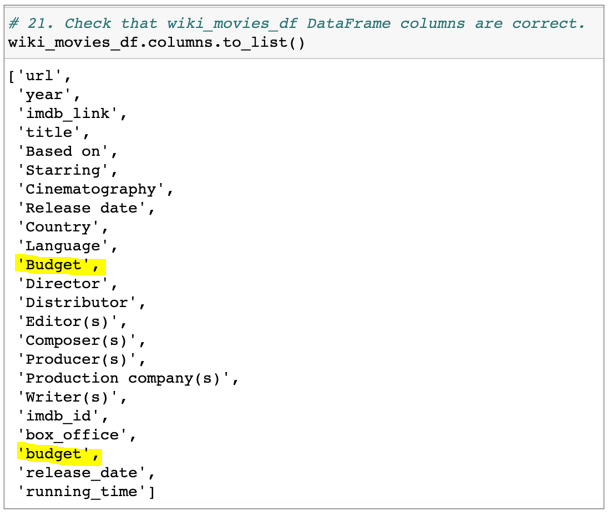
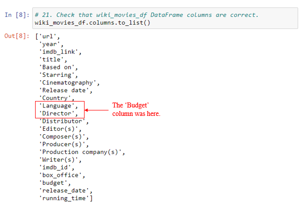
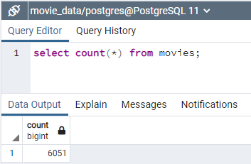
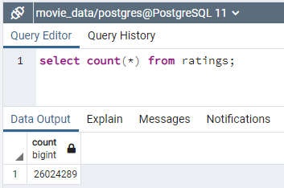

# Movies-ETL
The purpose of this README file is to keep track of all the work that is done in completing the full assignment. The file will include an outline of the work performed and any discrepancies that there may be between the output that I see vs the expected output according to the challenge documentation.

## Deliverable 1
The task at hand was to write an ETL function to read three data files, two CSV and one JSON. The output for the deliverable is three DataFrames. The output matched the challenge documentation for all three files, wiki_movies_df, kaggle_metadata and ratings.

## Deliverable 2
This deliverable built upon deliverable 1 to add code to clean and transform the wiki_movies_df. The data was cleaned by dropping any entries with episodes and the use of regular expressions. A the end of the deliverable 2 challenge work there were two images provided to be compare to my output. My DataFrame output indicated that there were 22 columns, not 23 as indicated in the module challenge documentation. The reason for this comes in the cleaning of the **'Budget'** column. As part of the cleanup, this column was dropped after making sure that all the data from column 'Budget' was included in the newly created column 'budget'. The module documentation includes both columns 'Budget' and 'budget'. Module documentation is shown below with the duplicate columns highlighted.

*Module Challenge Output*

*My Output*

## Deliverable 3
Deliverable 3 built on the code that was created in deliverable 2 to clean the kaggle_metadata. Once cleaned, the kaggle_metadata was merged with wiki_movies_df data. At this step we also used the duplicate data columns to create a more useful and complete data for columns via filling in missing data from one column to the other. The merged dataset was then combined with a cleaned version of the ratings data to a final merged dataset movies_with_ratings_df. with the completion of deliverable 3, my output matched the module challenge documents.

## Deliverable 4
This deliverable will create two tables, movies and ratings using the data from movies_df and the ratings.csv datasets. Because of the large size of the ratings.csv file, the data had to be imported in chunks of 1,000,000 rows. A check was done to make sure that the data in the tables were correct in value and type and that all the data rows were in fact imported to the tables. Two screen captures were done to show the row counts for each of the tables.

*Screen Capture for the movies Table*

*Screen Capture for the ratings table*

